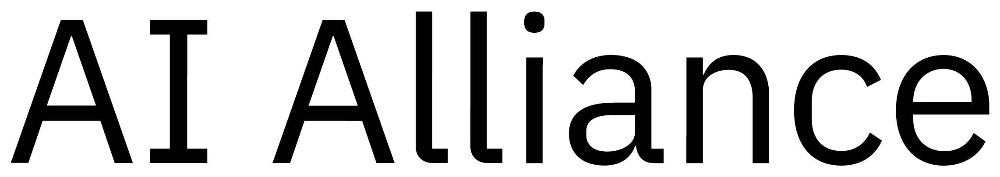

# Sponsors

We are grateful for the generous funding from our list of sponsors:

[Foundry](https://www.mlfoundry.com/): Foundry’s mission is to orchestrate the world’s compute capacity, rendering it universally accessible and useful. Our platform provides a seamless cloud experience to quickly and cost-effectively provision compute resources. Our aim is to make sophisticated cluster management and workload orchestration tools, currently only available to industry giants, accessible to everyone else. Founded by alumni from DeepMind’s core Deep Learning Team and Stanford’s CS PhD program (group led by Databricks co-founder Matei Zaharia), Foundry is backed by Sequoia, Lightspeed, and notable angels such as Google’s Jeff Dean & Eric Schmidt. 

[AI Alliance](https://thealliance.ai/): The AI Alliance is focused on fostering an open community and enabling developers and researchers to accelerate responsible innovation in AI while ensuring scientific rigor, trust, safety, security, diversity and economic competitiveness. We bring together a critical mass of compute, data, tools, and talent to accelerate and advocate for open innovation in AI.

<!--  -->

