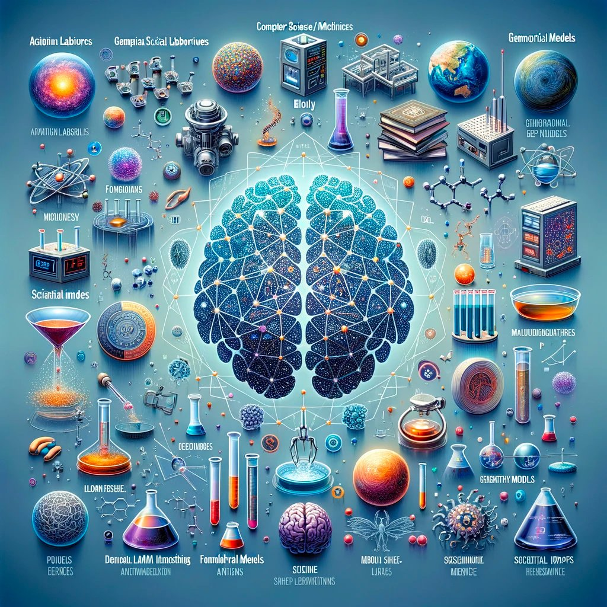
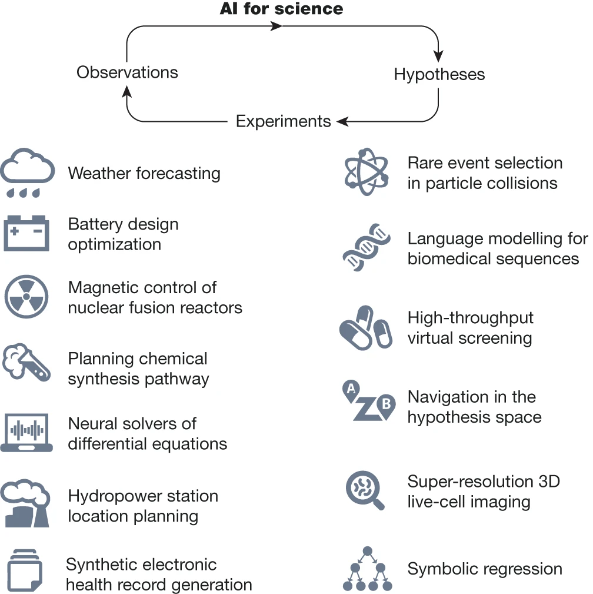

# About

For centuries, the method of discovery—the fundamental practice of science that scientists use to explain the natural world systematically and logically—has remained largely the same. Artificial intelligence (AI) and machine learning (ML) hold tremendous promise in having an impact on the way scientific discovery is performed today at the fundamental level. However, to realize this promise, we need to identify priorities and outstanding open questions for the cutting edge of AI going forward. We are a series of workshops that facilitate the development of AI for Science with the identified gaps from the [1st AI4Science workshop](neurips21.html) held with NeurIPS 2021 and theories and foundations from [2nd AI4Science workshop](icml22.html) with ICML 2022 and progress and promises from [3rd AI for Science workshop](neurips22.html) with NeurIPS 2022. We look forward to seeing you at [4th AI for Science workshop](neurips23.html) with NeurIPS 2023 in New Orleans. 

## News

Our blog “[AI for Science in 2023: A Community Primer](https://medium.com/@AI_for_Science/ai-for-science-in-2023-a-community-primer-d2c2db37e9a7)” is now live! In this blog, we delve into how AI intersects with various scientific fields - from Chemistry, Biology, Physics, Computer/Math. Science, Neuroscience to Earth Science.

Excited to share our [Nature paper](https://www.nature.com/articles/s41586-023-06221-2) on the role of AI in scientific discovery.  

## Follow Us

Please follow us on [Twitter](https://twitter.com/AI_for_Science) and [LinkedIn](https://www.linkedin.com/company/ai-for-science/) for the latest news, or join us on the [Slack](https://join.slack.com/t/ai4sciencecommunity/shared_invite/zt-15rtaehdi-we~H~LhzZqrQTy6RtLGtug) for active discussions.

